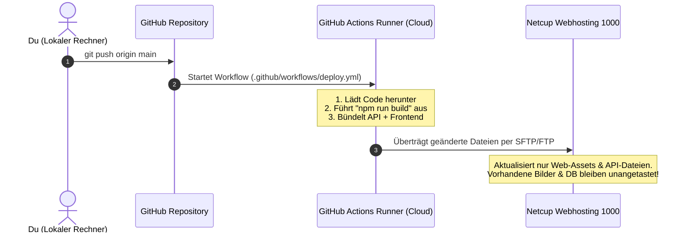

# Deployment & Update-Leitfaden: Netcup Webhosting 1000

Diese Anleitung erklärt:
1. Wie du die Plattform jetzt erstmals veröffentlichst.
2. Was die `deploy.yml` für GitHub Actions ist und wie sie funktioniert.
3. Wie du später Updates einspielst, **ohne** vorhandene Benutzerdaten, Trainingspläne oder hochgeladene Bilder zu gefährden.

---

## 1. Erstveröffentlichung auf Netcup

### Schritt 1: Plesk vorbereiten
1. **PHP-Version:** In Plesk unter *Websites & Domains > PHP-Einstellungen* auf `PHP 8.2` oder `8.3` stellen (`memory_limit = 512M`).
2. **Datenbank anlegen:** Unter *Datenbanken* eine MariaDB/MySQL-Datenbank erstellen (z. B. `k12345_radballhub`) samt Benutzer und Passwort.
3. **Tabellen importieren:** In phpMyAdmin die Datei `backend/database/schema.sql` und optional `backend/database/seeders.sql` importieren.
4. **E-Mail-Postfach:** Unter *E-Mail* das Postfach `noreply@deinedomain.de` anlegen.

### Schritt 2: Echte Passwörter schützen (`config.local.php`)
Erstelle auf dem Server im Ordner `/httpdocs/api/` eine Datei namens `config.local.php` (siehe Vorlage `backend/api/config.local.example.php`):
```php
<?php
define('DB_HOST', 'localhost');
define('DB_NAME', 'k12345_radballhub');
define('DB_USER', 'k12345_radball_user');
define('DB_PASS', 'DeinSicheresPasswortAusPlesk');

define('SMTP_HOST', 'mail.deinedomain.de');
define('SMTP_PORT', 465); // SSL
define('SMTP_USER', 'noreply@deinedomain.de');
define('SMTP_PASS', 'DeinMailPasswortAusPlesk');
define('ADMIN_EMAIL', 'admin@deinedomain.de');
```
> [!IMPORTANT]
> **Warum `config.local.php`?** Diese Datei steht in der `.gitignore`. Sie wird bei zukünftigen Updates oder Git-Deployments **niemals überschrieben**. Deine echten Zugangsdaten bleiben dauerhaft sicher auf dem Netcup-Server gespeichert!

### Schritt 3: Manuelles Hochladen (Alternative zu GitHub Actions)
Falls du nicht sofort GitHub nutzen möchtest:
1. Baue das Frontend lokal:
   ```bash
   cd frontend
   npm run build
   ```
2. Lade per FileZilla / WinSCP in den Netcup-Ordner `/httpdocs/` hoch:
   - Den Inhalt von `frontend/dist/*` direkt nach `/httpdocs/` (`index.html`, `assets/`)
   - Den Ordner `backend/api/` nach `/httpdocs/api/`
   - Die Datei `backend/.htaccess` nach `/httpdocs/.htaccess`
   - Lege den Ordner an: `/httpdocs/storage/uploads/exercises/` (Berechtigung `0755`)

---

## 2. Was ist die `deploy.yml` für GitHub?

Die Datei `.github/workflows/deploy.yml` ist ein automatisches **CI/CD-Skript (Continuous Deployment)** für GitHub Actions:



### Wie richtest du GitHub Actions ein?
1. Lade dein Projekt in ein (privates) GitHub Repository hoch.
2. Gehe in deinem GitHub-Repository auf:
   **Settings > Secrets and variables > Actions > New repository secret**
3. Lege folgende 3 Secrets an:
   * `NETCUP_FTP_HOST`: Der FTP-Host aus deiner Netcup-Plesk-Übersicht (z. B. `hostingXXXXX.a2xxx.netcup.net` oder `ftp.deinedomain.de`).
   * `NETCUP_FTP_USER`: Dein FTP-Benutzername aus Plesk.
   * `NETCUP_FTP_PASSWORD`: Dein FTP-Passwort.
4. **Fertig!** Sobald du nun Änderungen mit `git push` hochlädst, baut GitHub dein Frontend automatisch und synchronisiert nur die neuen Dateien auf den Netcup-Server.

---

## 3. Wie spiele ich später Updates ein, OHNE vorhandene Daten zu beschädigen?

Beim Betrieb einer produktiven Webanwendung gibt es **drei Bereiche mit Daten**, die niemals beschädigt werden dürfen:

### A. Die Datenbank (Übungen, Benutzer, gespeicherte Trainingspläne)
* **Die goldene Regel:** Führe im Live-Betrieb **niemals** erneut `schema.sql` oder `DROP TABLE` aus!
* **Wie macht man DB-Änderungen richtig?**
  Wenn in einem späteren Update z. B. ein neues Tabellenfeld benötigt wird, erstelle ein kleines Migrationsskript mit `ALTER TABLE`:
  ```sql
  -- Beispiel für ein späteres Update:
  ALTER TABLE exercises ADD COLUMN video_start_seconds INT NULL DEFAULT 0;
  ```
  Dieses Skript führst du in phpMyAdmin aus. Alle bestehenden Datensätze bleiben zu 100 % erhalten.

### B. Die hochgeladenen Bilder (`storage/uploads/exercises/`)
* In unserer `deploy.yml` ist die Option `dangerous-clean-slate: false` gesetzt. Das bedeutet: Der Deployment-Prozess löscht auf dem Server **niemals** Dateien, die dort von Nutzern hochgeladen wurden.
* Zudem ist dieser Ordner in der Root-`.gitignore` eingetragen, damit lokale Testbilder nicht die Bilder auf dem Server überschreiben.

### C. Die Konfiguration & Passwörter (`api/config.local.php`)
* Da deine echten Passwörter in `config.local.php` auf dem Server liegen und diese Datei in der `.gitignore` ignoriert wird, fasst kein Git-Update deine Zugangsdaten an.

---

## 4. Sicherheits-Checkliste vor jedem größeren Update

1. **Plesk Backup-Manager nutzen:**
   - In Plesk auf **Websites & Domains > Backup-Manager** gehen.
   - Auf **Sichern** klicken (dauert ca. 30 Sekunden). Netcup erstellt einen Snapshot der Datenbank und aller Dateien.
2. **Katalog-Backup in RadballHub herunterladen:**
   - Klicke im Menü von RadballHub einfach auf **"Katalog-Backup (ZIP)"**. Du erhältst sofort eine lokale Sicherheitskopie aller Übungen und Bilddateien.
3. **Code aktualisieren:**
   - Git push durchführen oder neue `frontend/dist`-Dateien hochladen.
